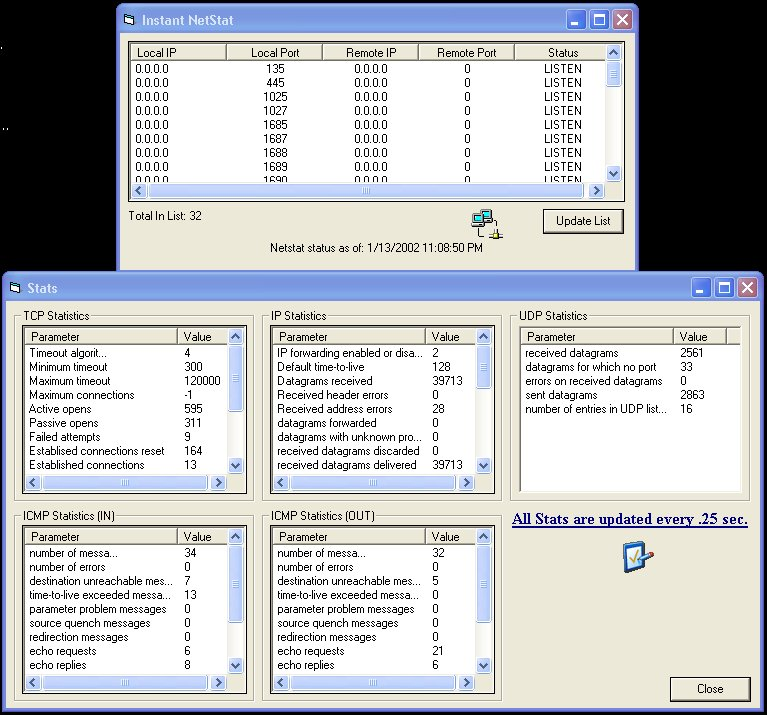



## Instant NetStat and Stats With API \(FAST\!\)

### Description

Get tons of info about TCP and IP and more. Netstat with api calls, so fast it is instant. See pic for details. Please Vote. I hope this helps anybody needing this. I tried to make it nice and neat.
 
### More Info
 

             |
---                |---
**Submitted On**   |2002-01-13 23:07:50
**By**             |[Shane M Croft](https://github.com/Planet-Source-Code/PSCIndex/blob/master/ByAuthor/shane-m-croft.md)
**Level**          |Intermediate
**User Rating**    |5.0 (134 globes from 27 users)
**Compatibility**  |VB 6\.0
**Category**       |[Complete Applications](https://github.com/Planet-Source-Code/PSCIndex/blob/master/ByCategory/complete-applications__1-27.md)
**World**          |[Visual Basic](https://github.com/Planet-Source-Code/PSCIndex/blob/master/ByWorld/visual-basic.md)
**Archive File**   |[Instant\_Ne485491142002\.zip](https://github.com/Planet-Source-Code/shane-m-croft-instant-netstat-and-stats-with-api-fast__1-30786/archive/master.zip)

